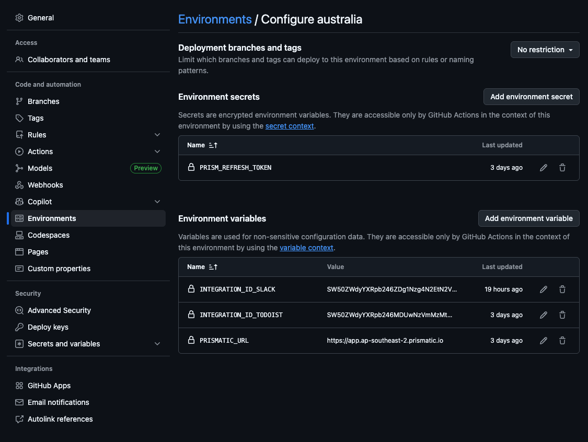
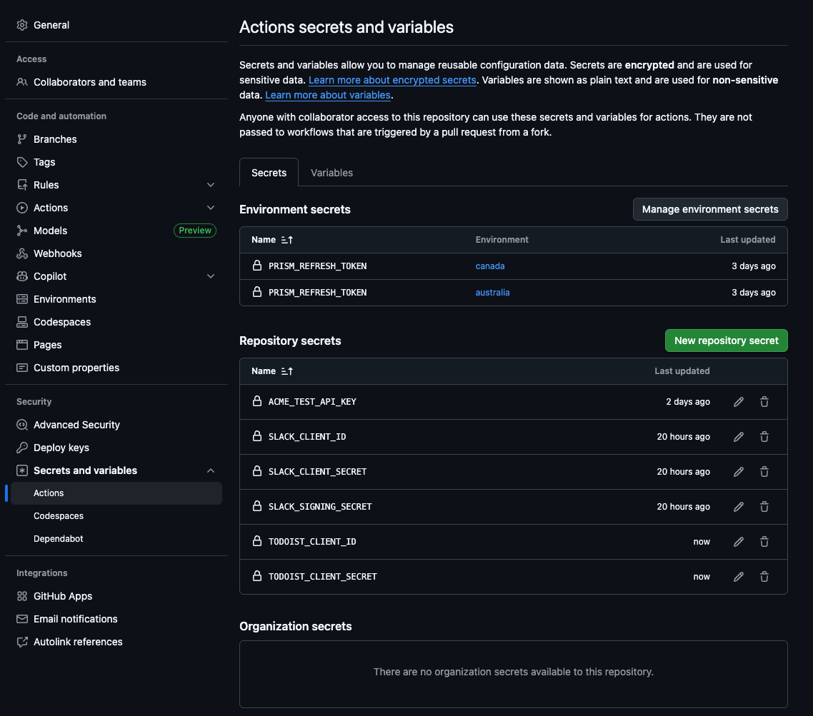

# Example Prismatic Repository Structure

This repository provides an example structure for organizing the custom components and code-native integrations that you build within the [Prismatic](https://prismatic.io/docs/) integration platform.
While this example demonstrates a CI/CD pipeline using GitHub Actions, you can adapt the structure and workflows to fit your team's preferred tools and processes.

## Project Structure

This project contains four main directories:

- `.github/workflows` contains GitHub workflows that publish custom components and import code-native integrations into the Prismatic platform.
  - `components.yml` workflow builds and deploys custom components to Prismatic when changes are made to the component or its dependencies.
  - `integrations.yml` workflow packages and imports code-native integrations into Prismatic when changes are made to the integration or its dependencies.
- `components/` contains [custom components](https://prismatic.io/docs/custom-connectors/) that can be used across multiple integrations in the low-code builder.
  - `acme/` is an example custom component that represents "Our App" in this repository.
  - `todoist/` is an example custom component that wraps the [Todoist](https://todoist.com/) API.
- `integrations/` contains [code-native integrations](https://prismatic.io/docs/integrations/code-native/) that can be deployed to customers.
  - `slack/` is an example code-native integration that pulls todo items from the "Acme" API and sends them to a Slack channel.
  - `todoist/` is an example code-native integration that pulls todo items from Todoist and imports them to "Acme".
- `shared-libs/` contains shared code that can be used by both components and integrations.
  - `acme/` is a shared library used by the Acme component and both code-native integrations.
  - `todoist/` is a shared library used by the Todoist component and Todoist code-native integration.

## Shared Libraries

Shared libraries are TypeScript packages that contain code shared between custom components and code-native integrations.
This allows you to avoid duplicating code and keep your components and integrations DRY.

For example, both the [Todoist component](./components/todoist) and the [Todoist code-native integration](./integrations/todoist) depend on the shared library in [shared-libs/todoist](./shared-libs/todoist) to handle authentication and API requests to Todoist.

The [Acme shared library](./shared-libs/acme) is used by the Acme custom component as well as both code-native integrations to interact with the Acme API.

### Why use shared libraries rather than component manifests?

When building code-native integrations, your integration can leverage existing components (both built-in and custom components) by adding those components' [manifests](https://prismatic.io/docs/integrations/code-native/existing-components/#adding-component-manifests-to-your-code-native-project) to the integration project.
The [Slack code-native integration](./integrations/slack) in this repository demonstrates this approach by including a manifest of the built-in [Slack component](./integrations/slack/src/manifests/).

For custom components, using shared libraries is often a better approach than relying on component manifests:

1. **Fewer iterations**: When you update a shared library, both the custom component and code-native integrations that depend on it can immediately benefit from the changes without needing to republish component manifests and update integration projects.
2. **Code is local**: When referencing shared libraries, all the code is local to the repository. This makes it easier to navigate and understand the codebase.
   When using manifests, you have a TypeScript manifest in your hands but the actual component code lives in the Prismatic platform, which can make it harder to trace through the code.
3. **Don't repeat yourself**: Shared libraries allow you to encapsulate common logic and functionality in one place, reducing code duplication across components and integrations.

## CI/CD Workflows

This repository includes two GitHub Actions workflows that automate the process of publishing custom components and importing code-native integrations into the Prismatic platform.

### Components Workflow

The [components.yml](./.github/workflows/components.yml) workflow is triggered when changes are pushed to the `main` branch that affect files in the `components/` or `shared-libs/` directories.

For example, if you update [components/acme/src/index.ts](./components/acme/src/index.ts) or [shared-libs/acme/src/client.ts](./shared-libs/acme/src/client.ts), the workflow will publish the updated Acme custom component.

This workflow performs the following steps:

1. Checks out the repository code.
1. Sets up Node.js.
1. Installs dependencies using `npm install`.
1. Runs unit tests (if any) using `npm run test`.
1. Builds the custom components.
1. For each production environment (we use Australia and Canada), publishes the updated custom components to the Prismatic region using the [Component Publisher](https://github.com/prismatic-io/component-publisher/) GitHub action.

### Integrations Workflow

The [integrations.yml](./.github/workflows/integrations.yml) workflow is triggered when changes are pushed to the `main` branch that affect files in the `integrations/` or `shared-libs/` directories.

For example, if you update [integrations/slack/src/index.ts](./integrations/slack/src/index.ts) or [shared-libs/acme/src/client.ts](./shared-libs/acme/src/client.ts), the workflow will package and import the updated Slack code-native integration.

This workflow performs the following steps:

1. Checks out the repository code.
1. Sets up Node.js.
1. Installs dependencies using `npm install`.
1. Builds the code-native integrations.
1. For each production environment (we use Australia and Canada), packages and imports the updated code-native integrations into the Prismatic region using the [Integration Publisher](https://github.com/prismatic-io/integration-publisher) GitHub action.

> **Note on integration IDs**: Each code-native integration must have a unique integration ID within each Prismatic region. So, each integration must be published once manually to a production region before using the Integration Publisher GitHub action.
>
> These IDs are stored as environment variables in the GitHub repository settings and referenced in the workflow. For example, the Canada environment has a variable named `INTEGRATION_ID_SLACK` that contains the Slack integration's ID in the Canada region.

## Environments and Variables

Both of the workflows (components and integrations) deploy to multiple Prismatic regions - we use Australia and Canada.
Each environment contains a `PRISMATIC_URL` variable and `PRISM_REFRESH_TOKEN` secret that the workflows use to authenticate with Prismatic in each region.

Additionally, each environment contains the `INTEGRATION_ID_<INTEGRATION_NAME>` variables that store the unique IDs of each code-native integration in that region.

Other secrets are stored globally, including OAuth 2.0 client credentials for the Slack and Todoist APIs.

---

## What is Prismatic?

Prismatic is the leading embedded iPaaS, enabling B2B SaaS teams to ship product integrations faster and with less dev time. The only embedded iPaaS that empowers both developers and non-developers with tools for the complete integration lifecycle, Prismatic includes low-code and code-native building options, deployment and management tooling, and self-serve customer tools.

Prismatic's unparalleled versatility lets teams deliver any integration from simple to complex in one powerful platform. SaaS companies worldwide, from startups to Fortune 500s, trust Prismatic to help connect their products to the other products their customers use.

With Prismatic, you can:

- Build [integrations](https://prismatic.io/docs/integrations/) using our [intuitive low-code designer](https://prismatic.io/docs/integrations/low-code-integration-designer/) or [code-native](https://prismatic.io/docs/integrations/code-native/) approach in your preferred IDE
- Leverage pre-built [connectors](https://prismatic.io/docs/components/) for common integration tasks, or develop custom connectors using our TypeScript SDK
- Embed a native [integration marketplace](https://prismatic.io/docs/embed/) in your product for customer self-service
- Configure and deploy customer-specific integration instances with powerful configuration tools
- Support customers efficiently with comprehensive [logging, monitoring, and alerting](https://prismatic.io/docs/monitor-instances/)
- Run integrations in a secure, scalable infrastructure designed for B2B SaaS
- Customize the platform to fit your product, industry, and development workflows

## Who uses Prismatic?

Prismatic is built for B2B software companies that need to provide integrations to their customers. Whether you're a growing SaaS startup or an established enterprise, Prismatic's platform scales with your integration needs.

Our platform is particularly powerful for teams serving specialized vertical markets. We provide the flexibility and tools to build exactly the integrations your customers need, regardless of the systems you're connecting to or how unique your integration requirements may be.

## What kind of integrations can you build using Prismatic?

Prismatic supports integrations of any complexity - from simple data syncs to sophisticated, industry-specific solutions. Teams use it to build integrations between any type of system, whether modern SaaS or legacy with standard or custom protocols. Here are some example use cases:

- Connect your product with customers' ERPs, CRMs, and other business systems
- Process data from multiple sources with customer-specific transformation requirements
- Automate workflows with customizable triggers, actions, and schedules
- Handle complex authentication flows and data mapping scenarios

For information on the Prismatic platform, check out our [website](https://prismatic.io/) and [docs](https://prismatic.io/docs/).

## License

This repository is MIT licensed.
